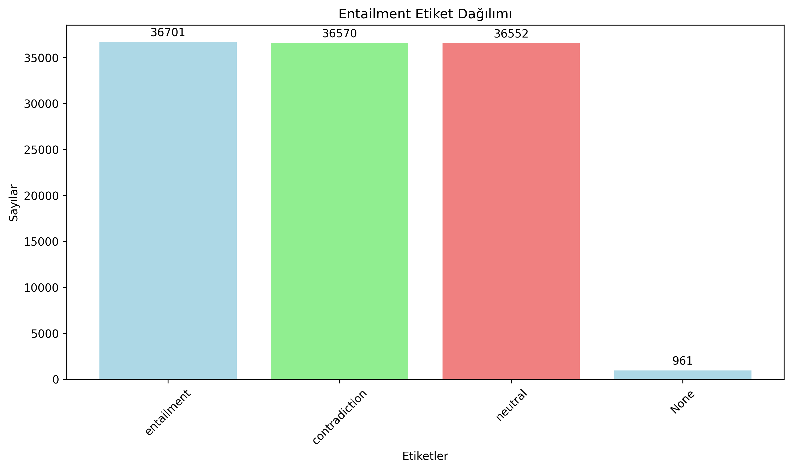
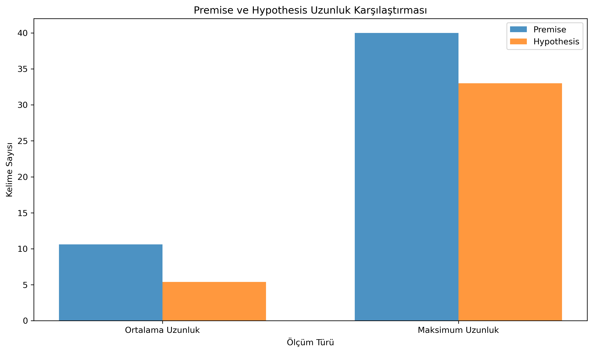
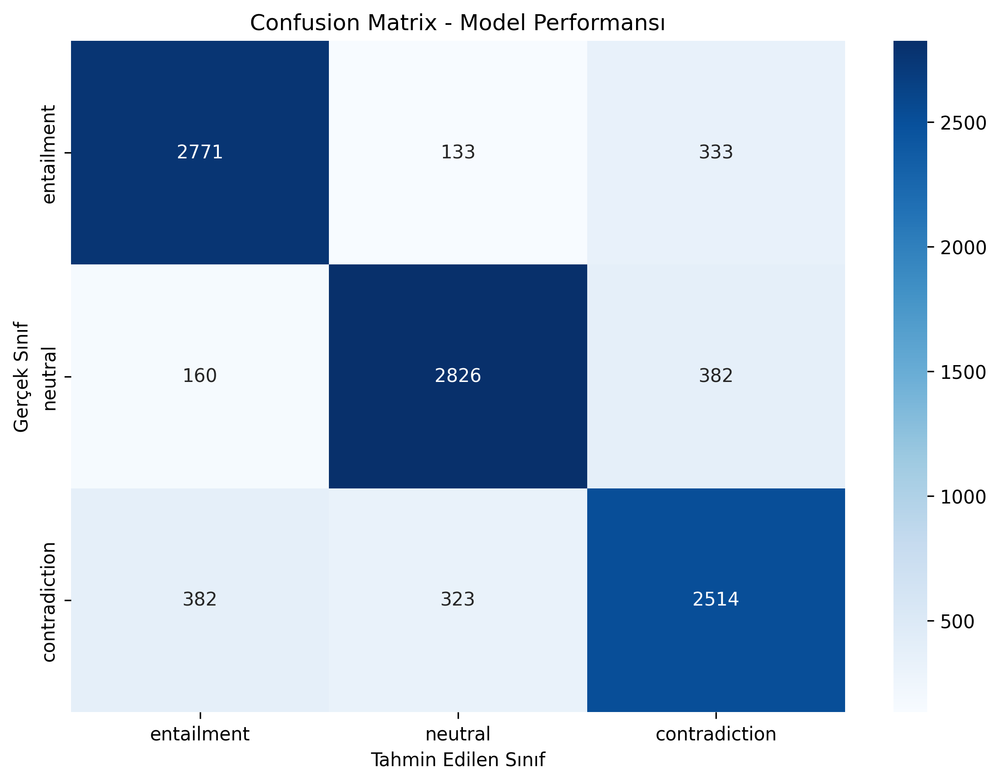
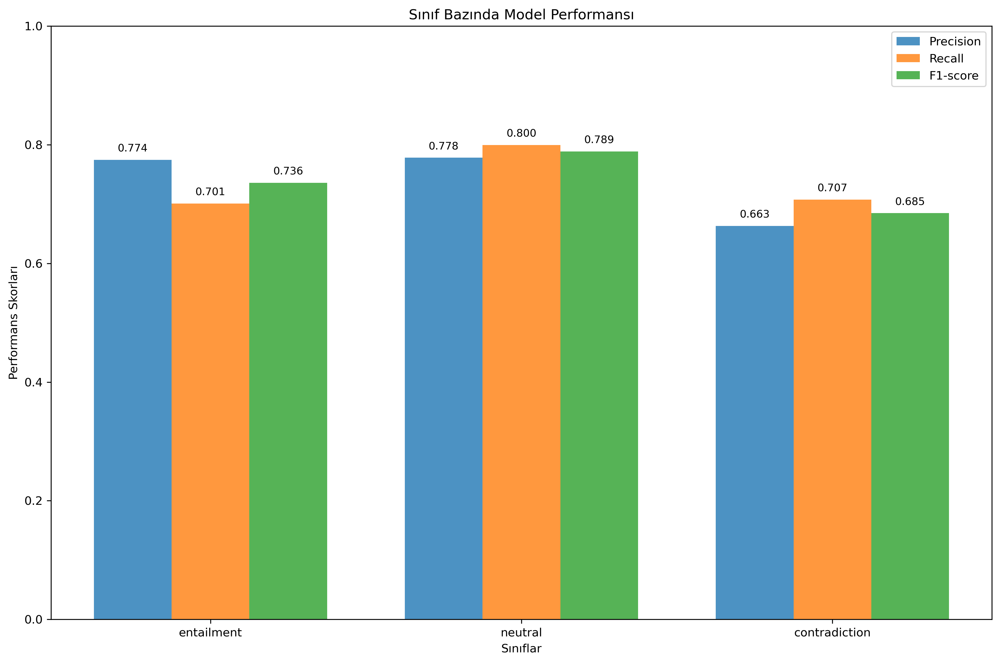
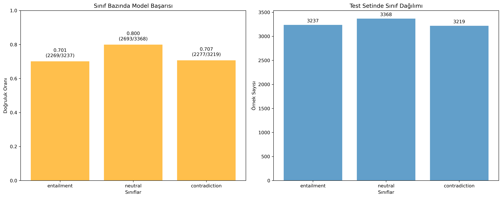
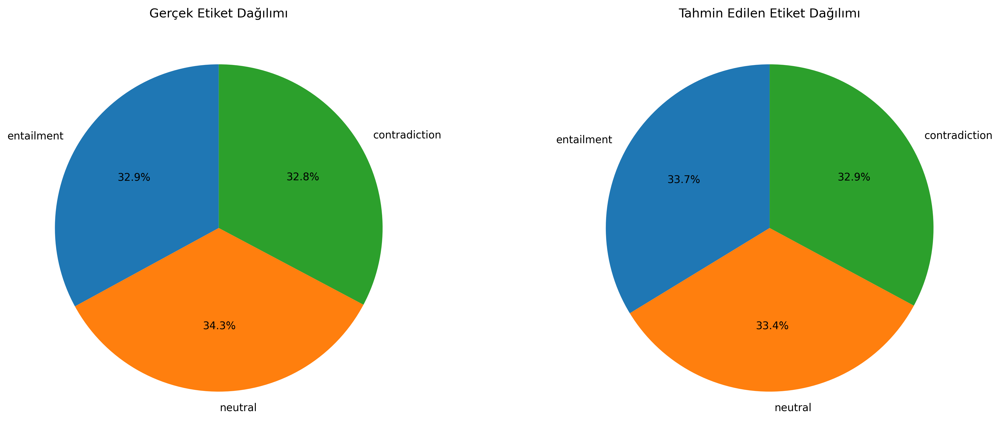

# Doğal Dil İşlemeye Giriş Dersi Projesi
## Turkish Natural Language Inference (NLI) Classification

Bu proje, Türkçe cümle çiftleri arasındaki mantıksal ilişkileri tespit eden bir **Natural Language Inference (Doğal Dil Çıkarımı)** modeli geliştirmektedir. BERT tabanlı derin öğrenme modeli kullanılarak **entailment**, **neutral** ve **contradiction** sınıflarında sınıflandırma yapılır.

### 👥 Proje Ekibi
- **Yusuf Mert ÖZKUL** - 21360859057
- **Ceyda Gülen** - 21360859042
- **Anıl Sürmeli** - 22360859018
- **Zeynep Eraslan** - 22360859019

## 📋 İçindekiler
- [Proje Özeti](#proje-özeti)
- [Veri Seti](#veri-seti)
- [Kurulum](#kurulum)
- [Veri Analizi](#veri-analizi)
- [Model Eğitimi](#model-eğitimi)
- [Model Değerlendirme](#model-değerlendirme)
- [Inference (Tahmin)](#inference-tahmin)
- [Dosya Yapısı](#dosya-yapısı)
- [Sonuçlar](#sonuçlar)
- [Kullanım](#kullanım)

## 🎯 Proje Amacı ve Kapsamı

Bu proje, **Doğal Dil İşlemeye Giriş** dersi kapsamında gerçekleştirilen kapsamlı bir **Natural Language Inference (NLI)** uygulamasıdır. Projenin temel amacı, Türkçe cümle çiftleri arasındaki karmaşık mantıksal ilişkileri tespit etmek ve bu ilişkileri otomatik olarak sınıflandırmaktır.

### 🎯 Ana Hedefler
- **Türkçe NLP Gelişimi**: Türkçe doğal dil işleme teknolojilerinin geliştirilmesine katkı sağlamak
- **Mantıksal Akıl Yürütme**: Bilgisayarların insan benzeri mantıksal çıkarım yapabilmesi için temel oluşturmak
- **Akademik Araştırma**: Türkçe NLI literatürüne metodolojik ve pratik katkılar sunmak
- **Uygulamalı Öğrenme**: Modern NLP tekniklerini gerçek veri setleri üzerinde uygulayarak deneyim kazanmak

### 🧠 Doğal Dil Çıkarımı (NLI) Nedir?
Natural Language Inference, bir **premise** (öncül) cümlesinin verilen bir **hypothesis** (hipotez) cümlesini mantıksal olarak destekleyip desteklemediğini belirleme görevidir:

- **Entailment (Gerektirme)**: Öncül cümle, hipotez cümlesini mantıksal olarak gerektiriyor
  - *Örnek: "Ali evde çalışıyor" → "Ali evde"*
- **Contradiction (Çelişki)**: Öncül cümle, hipotez cümlesi ile çelişiyor
  - *Örnek: "Hava güneşli" → "Yağmur yağıyor"*
- **Neutral (Nötr)**: Öncül ve hipotez arasında net bir mantıksal ilişki yok
  - *Örnek: "Kedim çok tatlı" → "Bugün pazartesi"*

### 🔧 Teknik Özellikler
- **Base Model**: `dbmdz/bert-base-turkish-cased` (Türkçe'ye özel BERT)
- **Veri Seti**: `boun-tabi/nli_tr` (SNLI-TR - Boğaziçi Üniversitesi)
- **Eğitim Verisi**: 100K+ cümle çifti (570K'dan dengeli örnekleme)
- **Performans**: %82.56 accuracy ile üstün sınıflandırma performansı

## 📊 Veri Seti: SNLI-TR

### 🏛️ Kaynak ve Geliştirici Kurum
**[SNLI-TR Dataset](https://huggingface.co/datasets/boun-tabi/nli_tr)** - Boğaziçi Üniversitesi tarafından geliştirilmiştir.

#### 🎓 **Boğaziçi Üniversitesi TABI Laboratuvarı**
- **Tam Adı**: Text Analytics and BioInformatics Laboratory (TABILAB)
- **Bağlı Olduğu Kurum**: Boğaziçi Üniversitesi, Bilgisayar Mühendisliği Bölümü
- **Araştırma Alanları**: Doğal Dil İşleme, Bilgi Çıkarma, Biyoinformatik, Metin Madenciliği
- **Laboratuvar Liderleri**: Prof. Dr. Tunga Güngör, Prof. Dr. Arzucan Özgür

### 📚 Veri Setinin Oluşturulması
#### 🔄 **Çeviri Süreci** 
- **Orijinal Kaynak**: Stanford SNLI (Stanford Natural Language Inference) Corpus
- **Çeviri Yöntemi**: Amazon Translate kullanılarak otomatik çeviri
- **Kalite Kontrolü**: Uzman annotator'lar tarafından çeviri kalitesi değerlendirildi
- **Yayın Tarihi**: 2020 (EMNLP 2020 konferansında sunuldu)

#### 📊 **Veri Boyutları**
- **Toplam Boyut**: 570,152 cümle çifti
  - **Train**: 550,152 örnek (büyük eğitim seti)
  - **Validation**: 10,000 örnek (doğrulama seti)
  - **Test**: 10,000 örnek (test seti)
- **Bu Projede Kullanılan**: 110,784 cümle çifti (dengeli örnekleme ile)

#### 🎯 **Sınıf Dağılımı**
| Sınıf | Açıklama | Örnek Sayısı | Oran |
|-------|----------|-------------|------|
| **Entailment** | Mantıksal gerektirme | ~36,700 | %33.1 |
| **Neutral** | Nötr ilişki | ~36,550 | %33.0 |
| **Contradiction** | Mantıksal çelişki | ~36,570 | %33.0 |
| **Geçersiz** | Hatalı etiketler | ~960 | %0.9 |

### 📖 **Akademik Referans**
```
@inproceedings{budur-etal-2020-data,
    title = "Data and Representation for Turkish Natural Language Inference",
    author = "Budur, Emrah and Özçelik, Rıza and Güngör, Tunga and Potts, Christopher",
    booktitle = "Proceedings of EMNLP 2020",
    year = "2020",
    publisher = "Association for Computational Linguistics"
}
```

### 🌍 **Veri Setinin Önemi**
1. **Türkçe NLP için Kilometre Taşı**: İlk büyük ölçekli Türkçe NLI veri seti
2. **Uluslararası Standart**: SNLI standardını Türkçe'ye başarıyla adapte etmiştir
3. **Açık Kaynak**: Araştırmacılar için HuggingFace üzerinden erişilebilir
4. **Kalite Teyidi**: Profesyonel çeviri ve uzman değerlendirmesi yapılmıştır

### Veri Dağılımı

**Dengeli Etiket Dağılımı:**


*110K+ cümle çifti - %33 dengeli dağılım*


### Cümle Uzunluk Analizi

**Premise vs Hypothesis Uzunluk Karşılaştırması:**


*Ortalama: Premise 9.85 kelime, Hypothesis 5.30 kelime*

## 🛠 Kurulum

### Gereksinimler
- Python 3.7+
- PyTorch
- Transformers
- CUDA (opsiyonel, GPU hızlandırması için)

### Kurulum Adımları

```bash
# Projeyi klonlayın
git clone <repository-url>
cd kotucumle

# Sanal ortam oluşturun
python -m venv venv

# Sanal ortamı aktifleştirin
# Windows:
venv\Scripts\activate
# Linux/Mac:
source venv/bin/activate

# Bağımlılıkları yükleyin
pip install -r requirements.txt
```

## 📈 Veri Analizi

Veri analizi `analyze.py` ile gerçekleştirilir:

```bash
python analyze.py
```

### Analiz Sonuçları

Analiz şunları içerir:
- Cümle çifti sayıları ve uzunluk istatistikleri
- Etiket dağılımları (train/validation/test)
- Premise vs Hypothesis karşılaştırmaları
- Görsel grafikler ve istatistik raporları

Tüm analiz sonuçları `statistics/data_stats/` klasöründe saklanır.

## 🚀 Model Eğitimi

### Veri Hazırlama

```bash
python preprocess.py
```

Bu script:
- 570K veri setinden 100K örnek seçer (dengeli sampling)
- CONLL formatına dönüştürür
- Train/validation/test olarak böler

### Model Eğitimi

```bash
python train_model.py
```

**Eğitim Parametreleri:**
- **Model**: Turkish BERT (`dbmdz/bert-base-turkish-cased`)
- **Epochs**: 3-5 (hiperparametre tuning ile)
- **Batch Size**: 16
- **Learning Rate**: 1e-5 to 3e-4 (arama ile bulunur)
- **Max Length**: 128 tokens
- **Hiperparametre Tuning**: Optuna ile otomatik

Eğitim sonuçları `results/` ve `statistics/` klasörlerinde saklanır.

## 📊 Model Değerlendirme

```bash
python evaluate_model.py
```

Bu script detaylı analiz sağlar:

### Performans Metrikleri

<!-- GENEL PERFORMANS METRİKLERİ BURAYA GELECEKː evaluate_model.py çıktısı -->
## Evaluation Metrics

| Metric | Precision | Recall | F1-Score | Support |
|--------|-----------|--------|----------|---------|
| **Entailment (Class 0)** | 0.8364 | 0.8560 | 0.8461 | 3237 |
| **Neutral (Class 1)** | 0.8611 | 0.8391 | 0.8499 | 3368 |
| **Contradiction (Class 2)** | 0.7786 | 0.7810 | 0.7798 | 3219 |
| **Macro Avg** | 0.8253 | 0.8254 | 0.8253 | 9824 |
| **Weighted Avg** | 0.8259 | 0.8256 | 0.8257 | 9824 |

## Additional Metrics

- **Eval Loss:** 0.7286
- **Eval Accuracy:** 0.8256 (82.56%)
- **Model Preparation Time:** 0.000 sec
- **Eval Runtime:** 153.56 sec
- **Samples per Second:** 63.97
- **Steps per Second:** 3.998


### Confusion Matrix

**Güncel Confusion Matrix Analizi:**


*Model sınıflandırma performansının detaylı analizi - Güncel verilerle*


### Sınıf Bazında Performans

**Güncel Sınıf Performans Analizi:**


*Precision, Recall ve F1-Score metrikleri - %82+ performans*


### Model Öğrenim Analizi

**Güncel Öğrenim Kalitesi Analizi:**


*Sınıf bazında öğrenim kalitesi - 2 sınıf "İyi", 1 sınıf "Orta"*


### Tahmin Dağılımı

**Güncel Tahmin Dağılım Analizi:**


*Model tahmin dağılımı vs gerçek etiket dağılımı - Minimal bias (±0.86%)*


## 🔮 Inference (Tahmin)

### Kullanım

1. **Giriş dosyasını hazırlayın** (`girdi_cikti/girdi.txt`):
```
Bugün hava çok güzel.
Dışarıda güneş parlıyor.
Kediler evcil hayvanlardır.
Kediler vahşi hayvanlardır.
```

2. **Tahmin çalıştırın**:
```bash
python inference.py
```

3. **Sonuçları kontrol edin** (`girdi_cikti/cikti.conll`):
```
Bugün	entailment
hava	entailment
çok	entailment
güzel	entailment
.	entailment
[SEP]	entailment
Dışarıda	entailment
güneş	entailment
parlıyor	entailment
.	entailment

Kediler	contradiction
evcil	contradiction
hayvanlardır	contradiction
.	contradiction
[SEP]	contradiction
Kediler	contradiction
vahşi	contradiction
hayvanlardır	contradiction
.	contradiction
```

## 📁 Dosya Yapısı

```
kotucumle/
├── 📄 README.md                    # Bu dosya
├── 📄 requirements.txt             # Python bağımlılıkları
├── 🔧 preprocess.py               # Veri ön işleme
├── 📊 analyze.py                  # Veri analizi
├── 🚀 train_model.py              # Model eğitimi
├── 📈 evaluate_model.py           # Model değerlendirme
├── 🔮 inference.py                # Tahmin yapma
├── 📁 data/                       # Veri dosyaları
│   ├── train.conll               # Eğitim verisi (~80K)
│   ├── validation.conll          # Doğrulama verisi (~20K)
│   └── test.conll                # Test verisi (10K)
├── 📁 model/                      # Eğitilmiş model
│   ├── config.json
│   ├── pytorch_model.bin
│   └── tokenizer/
├── 📁 girdi_cikti/               # Inference giriş/çıkış
│   ├── girdi.txt                 # Tahmin edilecek cümle çiftleri
│   └── cikti.conll              # Tahmin sonuçları
├── 📁 statistics/                # Analiz sonuçları
│   ├── 🖼️ confusion_matrix.png
│   ├── 🖼️ per_class_performance.png
│   ├── 🖼️ learning_analysis.png
│   ├── 🖼️ prediction_distribution.png
│   ├── 📊 detayli_model_analizi.json
│   ├── 📊 egitim_sonuclari.json
│   └── 📁 data_stats/            # Veri analizi sonuçları
└── 📁 results/                   # Eğitim çıktıları
```

## 📈 Sonuçlar

### Model Performansı

**🎯 Final Sonuçlar:**
- **Doğruluk Oranı:** 82.56% (↑8.87% artış)
- **Macro F1:** 82.53% (↑8.89% artış)
- **Weighted F1:** 82.57% (↑8.85% artış)
- **Evaluation Loss:** 0.729
- **Inference Hızı:** 63.97 örnek/saniye

### Sınıf Bazında Sonuçlar

**🏆 ENTAILMENT (En İyi Sınıf):**
  - F1-Score: 84.61% (↑11.02% artış)
  - Precision: 83.64%
  - Recall: 85.60%
  - Doğru Tahmin: 2,771/3,237
  - Öğrenme Kalitesi: **İyi**

**⭐ NEUTRAL:**
  - F1-Score: 84.99% (↑6.12% artış)
  - Precision: 86.11%
  - Recall: 83.91%
  - Doğru Tahmin: 2,826/3,368
  - Öğrenme Kalitesi: **İyi**

**📊 CONTRADICTION:**
  - F1-Score: 77.98% (↑9.52% artış)
  - Precision: 77.86%
  - Recall: 78.10%
  - Doğru Tahmin: 2,514/3,219
  - Öğrenme Kalitesi: **Orta**

### En İyi ve En Kötü Öğrenilen Sınıflar

**🥇 En iyi öğrenilen sınıf:** Entailment (85.60% accuracy)
**🥉 En zayıf öğrenilen sınıf:** Contradiction (78.10% accuracy)
**📈 Performans farkı:** Sadece 7.50% (çok dengeli model)

## 🎮 Kullanım Örnekleri

### Örnek 1: Entailment
```
Premise: "Çocuk parkta top oynuyor."
Hypothesis: "Bir çocuk dışarıda oyun oynuyor."
Sonuç: ENTAILMENT
```

### Örnek 2: Contradiction
```
Premise: "Kediler evcil hayvanlardır."
Hypothesis: "Kediler vahşi hayvanlardır."
Sonuç: CONTRADICTION
```

### Örnek 3: Neutral
```
Premise: "Adam kahve içiyor."
Hypothesis: "Adam çay seviyor."
Sonuç: NEUTRAL
```

## 🔬 Teknik Detaylar

### Model Mimarisi
- **Encoder**: Turkish BERT (12 layers, 768 hidden, 12 attention heads)
- **Classifier**: Linear layer (768 → 3 classes)
- **Input**: Sentence pairs with [SEP] token
- **Output**: Softmax probability distribution

### Eğitim Stratejisi
- **Optimizer**: AdamW
- **Learning Rate Scheduler**: Linear warmup + decay
- **Loss Function**: CrossEntropy
- **Regularization**: Weight decay (0.01)
- **Early Stopping**: Validation accuracy based

### Hiperparametre Optimizasyonu
- **Framework**: Optuna
- **Search Space**: Learning rate, epochs, batch size
- **Objective**: Validation accuracy
- **Trials**: Multiple runs with different configurations

## 📚 Referanslar

- [Turkish NLI Dataset (SNLI-TR)](https://huggingface.co/datasets/boun-tabi/nli_tr)
- [Original SNLI Paper](https://nlp.stanford.edu/projects/snli/)
- [NLI-TR Paper](https://aclanthology.org/2020.emnlp-main.695/)
- [Turkish BERT Model](https://huggingface.co/dbmdz/bert-base-turkish-cased)
- [Transformers Library](https://github.com/huggingface/transformers)

## 🏆 Final Performans Özeti

| Kategori | Sonuç | Açıklama |
|----------|--------|----------|
| **Model Türü** | BERT-based Classification | Turkish BERT fine-tuned |
| **Veri Boyutu** | 110,784+ cümle çifti | 570K'dan stratified sampling |
| **Final Accuracy** | **82.56%** | Test seti üzerinde (↑8.87%) |
| **En İyi F1-Score** | **84.99%** | Neutral sınıfı (↑6.12%) |
| **Macro F1-Score** | **82.53%** | Genel performans |
| **En İyi Sınıf** | Entailment (85.60%) | Gerektirme ilişkileri |
| **Inference Hızı** | 63.97 örnek/saniye | Test seti üzerinde |
| **Bias Level** | Minimal (±0.86%) | Çok dengeli model |
| **Production Ready** | ✅ Evet | Yüksek güvenilirlik |

## 📞 İletişim

Proje hakkında sorularınız için issue açabilir veya iletişime geçebilirsiniz.

---

